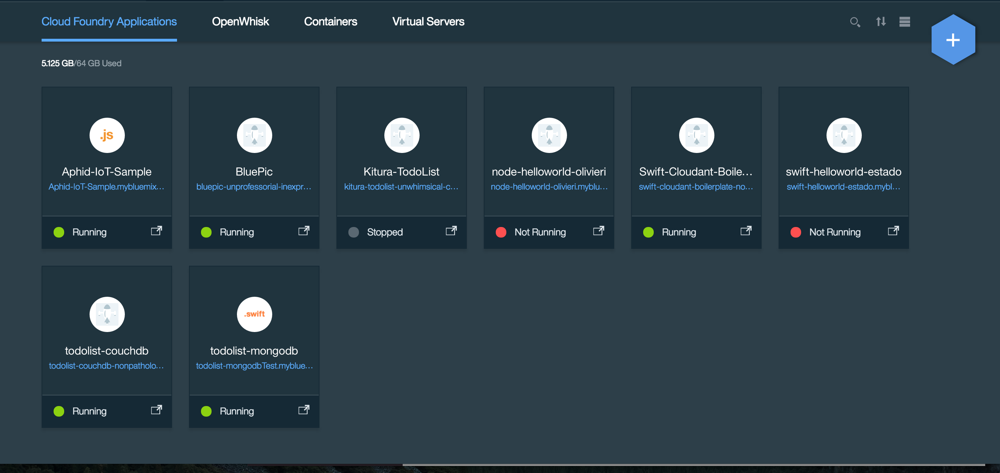
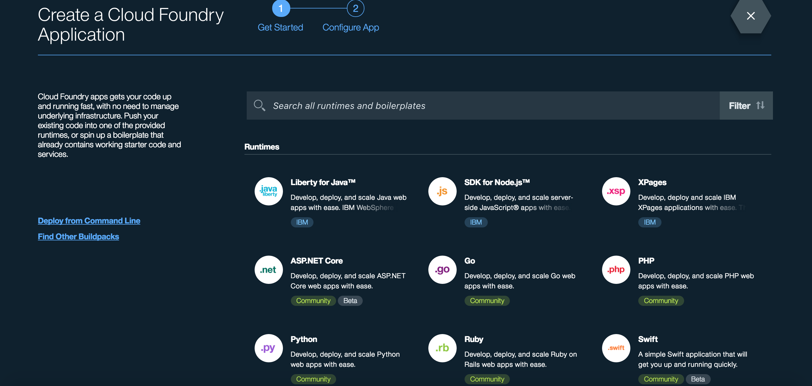
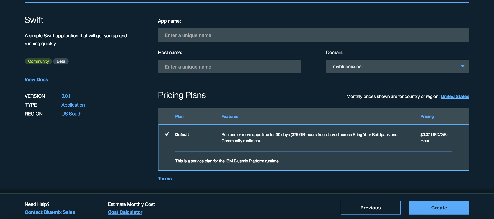
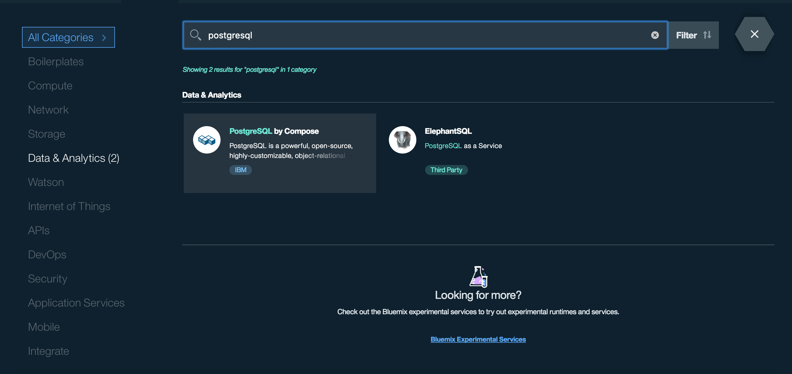
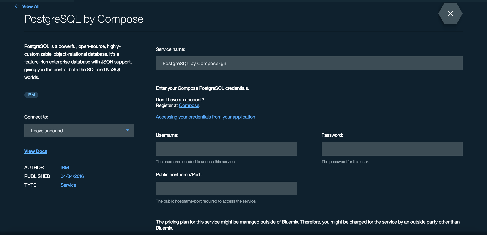
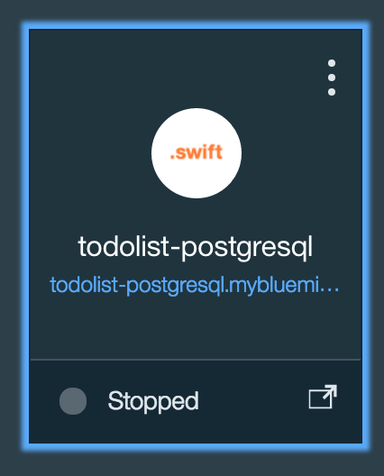

# TodoList PostgreSQL

[](https://travis-ci.org/IBM-Swift/TodoList-PostgreSQL)  [](https://swift.org/download/#snapshots)

Implements the [TodoListAPI](https://github.com/IBM-Swift/todolist-api) for TodoList.

## Quick start:

1. Download the [Swift DEVELOPMENT 06-20 snapshot](https://swift.org/download/#snapshots)

2. Download PostgreSQL
  You can use `brew install postgresql`

3. Clone the TodoList PostgreSQL repository
  `git clone https://github.com/IBM-Swift/todolist-postgresql`

4. Fetch the test cases by running:
  `git clone https://github.com/IBM-Swift/todolist-tests Tests`

5. Compile the library with `swift build -Xcc -I/usr/local/include -Xlinker -L/usr/local/lib` or create an XCode project with `swift package generate-xcodeproj`

6. Open the project

7. Change ```static let defaultPostgreHost = "/var/run/postgresql"``` to ```static let defaultPostgreHost = "localhost"``` & Change ```static let defaultPostgreUsername = "travis"``` to ```static let defaultPostgreUsername = "INSERT_OWN_DEFAULT_USERNAME"```
    ####Note: To see your own default username, do `psql --help`

6. Run the test cases with `swift test` or directly from XCode

##Setting up Swift application in Bluemix

1. Get an account for [Bluemix](https://new-console.ng.bluemix.net/?direct=classic) and go to Category called Compute

    

2. Then click the blue hexagon '+' icon on the top right corner

    

3. Look under the category of "Runtime" and click "Swift application"

    

4. Enter the app name as: todolist-postgresql and then create the application

    

##Setting up Postgresql service in Bluemix

1. Go to Bluemix homepage and click on the Category called Compute

    

2. Then click the blue hexagon '+' icon on the top right corner

    

3. Click "View all" on the top left corner, so it will show all categories

    

4. Search for Postgresql by Compose

    

5. Bound your Swift application to your Postgresql Service, create an account for [Compose] (https://www.compose.com/postgresql), and access your credentials from Compose and input it to Postgresql service.

    

6. Upon creation, you should see your unbound service on the dashboard page

    

7. SSH to the server and enter your password credentials (i.e)

  ```sql
  psql "sslmode=require host=INSERT_HOST_NAME port=INSERT_PORT_NUM dbname=compose user=admin"
  ```

8. Once in the server, create a database called "todolist"

  ```sql
  create database todolist;
  ```

9. Then create the table called "todos"

  ```sql
  create table todos(tid BIGSERIAL PRIMARY KEY, user_id varchar(128) NOT NULL, title varchar(256) NOT NULL, completed boolean NOT NULL, ordering INTEGER NOT NULL);
  ```

10. To confirm if you have the table created, you can ```\d todos```

##Deploying to Bluemix:

1. Dowload and install the Cloud Foundry tools:

  ```
  cf login
  bluemix api https://api.ng.bluemix.net
  bluemix login -u username -o org_name -s space_name
  ```

  ```
  Be sure to change the directory to the todolist-postgresql directory where the manifest.yml file is located.
  ```

2. Run ```cf push```

3. It should take several minutes, roughly 4-6 minutes. If it works correctly, it should state

  ```
  2 of 2 instances running
  App started
  ```
